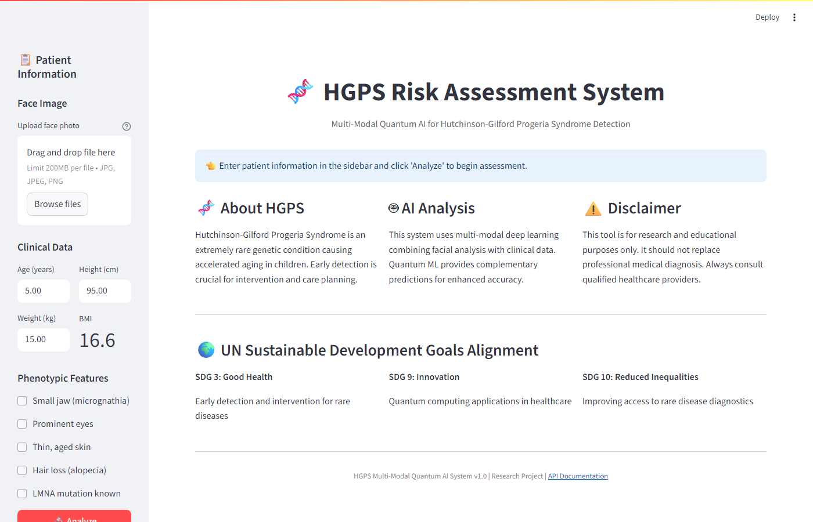
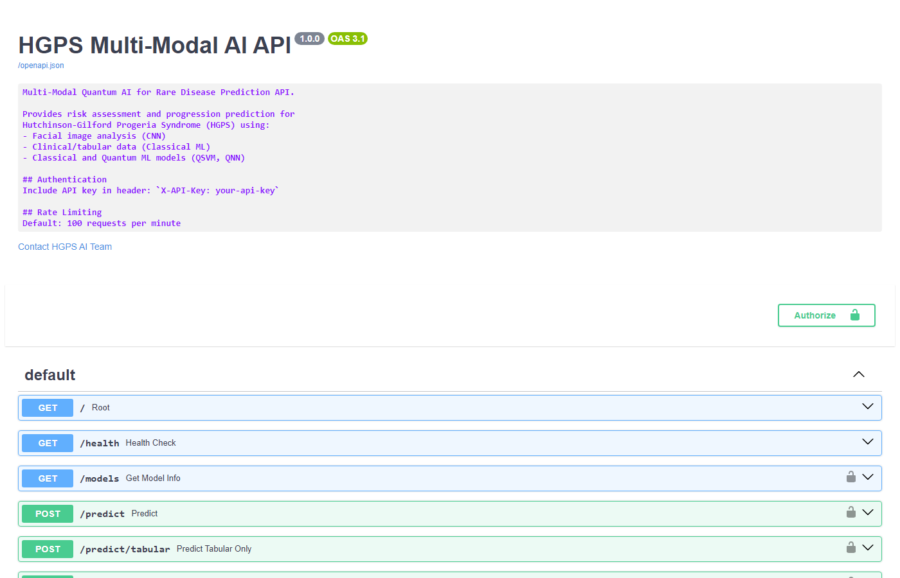
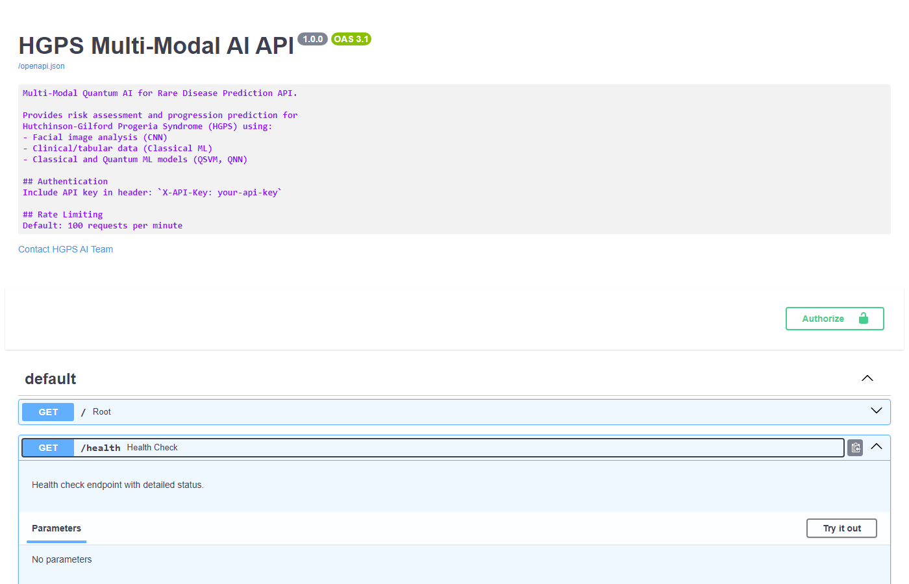

# Multi-Modal Quantum AI for Rare Disease Prediction

<p align="center">
  
  
  
  
  
  <br>
  <a href="https://github.com/10srav/Multi-Modal-Quantum-AI-for-Rare-Disease-Prediction/actions/workflows/ci.yml">
    
  </a>
  
  
</p>

<p align="center">
  <strong>A production-ready AI system combining Classical Machine Learning with Quantum Machine Learning for Hutchinson-Gilford Progeria Syndrome (HGPS) risk prediction.</strong>
</p>

<p align="center">
  
</p>

---

## Table of Contents

- [Overview](#overview)
- [Screenshots](#screenshots)
- [Key Features](#key-features)
- [Architecture](#architecture)
- [Model Performance](#model-performance)
- [Installation](#installation)
- [Quick Start](#quick-start)
- [Beginner's Quick Start Guide](#beginners-quick-start-guide)
- [API Reference](#api-reference)
- [Dashboard](#dashboard)
- [Production Deployment](#production-deployment)
- [Project Structure](#project-structure)
- [Testing](#testing)
- [UN SDG Alignment](#un-sustainable-development-goals-alignment)
- [Ethical Data Guidelines](#ethical-data-guidelines)
- [Limitations & Disclaimer](#limitations--disclaimer)
- [Contributing](#contributing)
- [License](#license)
- [Citation](#citation)

---

## Overview

Hutchinson-Gilford Progeria Syndrome (HGPS) is an extremely rare genetic disorder affecting approximately 1 in 4-8 million newborns worldwide. This project implements a state-of-the-art multi-modal AI system that combines:

- **Deep Learning**: ResNet18-based CNN for facial phenotype analysis
- **Classical ML**: Ensemble methods (XGBoost, Random Forest, SVM) for clinical data
- **Quantum ML**: QSVM and QNN using Qiskit for comparison studies
- **Multi-modal Fusion**: Combining image and tabular data for enhanced predictions

The system provides risk assessment, disease progression prediction, and growth curve analysis with explainable AI capabilities.

---

## Screenshots

### Clinical Dashboard
<p align="center">
  
  <br>
  <em>Main dashboard interface with patient information input, clinical data entry, and phenotypic feature selection</em>
</p>

### Clinical Data Input
<p align="center">
  
  <br>
  <em>Detailed clinical data entry with BMI calculation and HGPS-specific phenotypic markers</em>
</p>

### API Documentation
<p align="center">
  
  <br>
  <em>Interactive FastAPI documentation with all available endpoints</em>
</p>

### API Endpoint Details
<p align="center">
  
  <br>
  <em>Detailed endpoint documentation with request/response schemas</em>
</p>

---

## Key Features

| Feature | Description |
|---------|-------------|
| **Multi-Modal Fusion** | Combines facial images with clinical/tabular data |
| **Quantum ML Integration** | QSVM and QNN models using Qiskit framework |
| **Production-Ready API** | FastAPI with authentication, rate limiting, CORS |
| **Interactive Dashboard** | Streamlit-based clinical interface |
| **Explainable AI** | SHAP-based feature importance explanations |
| **Growth Curve Analysis** | WHO-based growth trajectory predictions |
| **Downloadable Reports** | Export assessments as Text or CSV files |
| **Docker Support** | Multi-stage production builds with Nginx |
| **Comprehensive Testing** | 45+ unit and integration tests |

---

## Architecture

### System Overview

```
                                    +------------------+
                                    |   Streamlit      |
                                    |   Dashboard      |
                                    +--------+---------+
                                             |
                                             v
+------------------+              +----------+----------+
|   Face Images    | ----------> |                     |
|   (UTKFace)      |             |    FastAPI Server   |
+------------------+             |                     |
                                 |  - Authentication   |
+------------------+             |  - Rate Limiting    |
|  Clinical Data   | ----------> |  - Model Inference  |
|  (Tabular)       |             |  - Explanations     |
+------------------+             +----------+----------+
                                            |
                    +-----------------------+-----------------------+
                    |                       |                       |
                    v                       v                       v
            +-------+-------+     +---------+---------+    +-------+-------+
            |   Face CNN    |     | Classical Models  |    |  QML Models   |
            |   (ResNet18)  |     | (XGBoost, SVM,    |    | (QSVM, QNN)   |
            |               |     |  Random Forest)   |    |               |
            +---------------+     +-------------------+    +---------------+
```

### Model Architecture

**Classical Pipeline:**
```
Face Image → ResNet18 → Face Embedding (256-d)
                                              ↘
                                               Fusion → MLP → Risk Score
                                              ↗
Clinical Data → StandardScaler → MLP → Tabular Embedding (64-d)
```

**Quantum Pipeline:**
```
Selected Features (6) → ZZFeatureMap → Quantum Kernel/RealAmplitudes → Measurement → Prediction
```

---

## Model Performance

### Training Results (Real UTKFace Images)

| Model | Test Accuracy | F1 Score | AUC | Notes |
|-------|--------------|----------|-----|-------|
| **SVM (Linear)** | 87.5% | 0.859 | 1.000 | Best classical performer |
| **XGBoost** | 75.0% | 0.643 | 1.000 | High AUC despite lower accuracy |
| **QSVM** | 75.0% | - | - | Quantum kernel SVM |
| **QNN** | 75.0% | - | - | Variational quantum classifier |
| **CNN (ResNet18)** | 62.5% | - | - | Image-only baseline |
| **Random Forest** | 75.0% | 0.643 | 0.917 | Ensemble method |

**Dataset Statistics:**
- Total Images: 50 (real child faces from UTKFace)
- HGPS Samples: 10 (20%)
- Control Samples: 40 (80%)
- Train/Val/Test Split: 35/7/8

---

## Installation

### Prerequisites

- Python 3.11+
- pip or conda
- (Optional) CUDA for GPU acceleration
- (Optional) Docker for containerized deployment

### Setup

1. **Clone the repository**:
```bash
git clone https://github.com/10srav/Multi-Modal-Quantum-AI-for-Rare-Disease-Prediction.git
cd Multi-Modal-Quantum-AI-for-Rare-Disease-Prediction
```

2. **Create virtual environment**:
```bash
python -m venv venv
source venv/bin/activate  # Linux/Mac
# or
venv\Scripts\activate  # Windows
```

3. **Install dependencies**:
```bash
pip install -r requirements.txt
```

4. **Verify installation**:
```bash
pytest tests/ -v
```

---

## Quick Start

### 1. Run the Dashboard

```bash
streamlit run src/dashboard.py
```

Access at `http://localhost:8501`

### 2. Run the API Server

```bash
uvicorn src.api:app --reload --port 8000
```

Access API docs at `http://localhost:8000/docs`

### 3. Make Predictions

**Using Python:**
```python
from src.api import PredictionEngine
from src.data import TabularPreprocessor
import joblib

# Load models
engine = PredictionEngine()
engine.load_models("models/")

# Make prediction
clinical_data = {
    "age": 5.0,
    "height_cm": 85.0,
    "weight_kg": 12.0,
    "small_jaw": 1,
    "prominent_eyes": 1,
    "thin_skin": 1,
    "hair_loss": 0,
    "lmna_mut": 0
}

result = engine.predict_tabular(clinical_data)
print(f"Risk Score: {result['risk_score']:.2%}")
```

**Using cURL:**
```bash
curl -X POST "http://localhost:8000/predict/tabular" \
  -H "Content-Type: application/json" \
  -d '{
    "age": 5.0,
    "height_cm": 85.0,
    "weight_kg": 12.0,
    "small_jaw": 1,
    "prominent_eyes": 1,
    "thin_skin": 1,
    "hair_loss": 0,
    "lmna_mut": 0
  }'
```

### 4. Train Models

```bash
# Train all models
python -m src.train --all

# Retrain with real images
python retrain_with_real_images.py
```

---

## Beginner's Quick Start Guide

If you're new to this project, follow these simple steps:

### Step 1: Clone the Repository
```bash
git clone https://github.com/10srav/Multi-Modal-Quantum-AI-for-Rare-Disease-Prediction.git
cd Multi-Modal-Quantum-AI-for-Rare-Disease-Prediction
```

### Step 2: Create Virtual Environment
```bash
# Windows
python -m venv venv
venv\Scripts\activate

# Mac/Linux
python3 -m venv venv
source venv/bin/activate
```

### Step 3: Install Dependencies
```bash
pip install -r requirements.txt
pip install qiskit qiskit-machine-learning qiskit-aer
```

### Step 4: Run the Dashboard
```bash
python -m streamlit run src/dashboard.py
```

### Step 5: Open in Browser
The dashboard will automatically open, or go to: **http://localhost:8501**

### What You'll See

1. **Sidebar** - Enter patient information:
   - Upload a face image (optional)
   - Enter age, height, weight
   - Check phenotypic features
   - Select model type (Auto/Fusion/TabularMLP/QSVM/QNN)

2. **Click "Analyze"** - Get predictions from:
   - Multi-Modal Fusion (CNN + Clinical)
   - TabularMLP (Clinical Only)
   - QSVM (Quantum SVM)
   - QNN (Quantum Neural Network)

3. **View Results**:
   - Risk score and classification
   - Disease progression prediction
   - Model comparison chart
   - Clinical recommendations
   - Downloadable reports (Text/CSV)

### Troubleshooting

| Issue | Solution |
|-------|----------|
| Streamlit not found | `pip install streamlit` |
| Models take long to load | Wait 1-2 minutes (first time only) |
| Port 8501 is busy | `python -m streamlit run src/dashboard.py --server.port 8502` |
| Qiskit import errors | `pip install qiskit qiskit-machine-learning qiskit-aer` |

### Run Tests (Optional)
```bash
pytest tests/ -v
```

---

## API Reference

<p align="center">
  
</p>

### Endpoints

| Endpoint | Method | Description |
|----------|--------|-------------|
| `/health` | GET | Health check and system status |
| `/models` | GET | List loaded models and versions |
| `/predict` | POST | Multi-modal prediction (image + clinical) |
| `/predict/tabular` | POST | Clinical data only prediction |
| `/predict/image` | POST | Image only prediction |
| `/predict/qml` | POST | Quantum vs Classical comparison |
| `/explain` | POST | SHAP-based feature explanations |
| `/growth-curve/{age}` | GET | Growth trajectory prediction |

### Request/Response Examples

**Tabular Prediction Request:**
```json
{
  "age": 5.0,
  "height_cm": 85.0,
  "weight_kg": 12.0,
  "small_jaw": 1,
  "prominent_eyes": 1,
  "thin_skin": 1,
  "hair_loss": 0,
  "lmna_mut": 0
}
```

**Response:**
```json
{
  "risk_score": 0.85,
  "risk_category": "High",
  "confidence": 0.92,
  "model_used": "xgboost",
  "recommendations": [
    "Urgent genetic testing recommended",
    "Cardiovascular assessment advised"
  ]
}
```

### Authentication

When `API_KEY_REQUIRED=true`, include the API key:

```bash
curl -H "X-API-Key: your-api-key" http://localhost:8000/predict/tabular ...
```

---

## Dashboard

The Streamlit dashboard provides an intuitive clinical interface:

<p align="center">
  
</p>

<p align="center">
  
</p>

### Features

1. **Patient Data Input**
   - Age, height, weight entry
   - Clinical phenotype checkboxes
   - Image upload capability

2. **Prediction Results**
   - Risk score visualization (gauge chart)
   - Disease progression prediction (Slow/Moderate/Rapid)
   - Confidence intervals
   - Model comparison (Classical vs Quantum)

3. **Explainability**
   - Feature importance charts
   - SHAP waterfall plots
   - Decision boundary visualization

4. **Growth Curves**
   - WHO-based percentile curves
   - HGPS-specific trajectories
   - Predicted growth patterns

5. **Downloadable Reports**
   - Text report with full assessment details
   - CSV data export for records and analysis
   - Includes patient info, risk scores, recommendations

### Running the Dashboard

```bash
# Default port
streamlit run src/dashboard.py

# Custom port
streamlit run src/dashboard.py --server.port 8502
```

---

## Production Deployment

### Docker Compose (Recommended)

```bash
# Copy environment file
cp .env.example .env

# Edit configuration
nano .env

# Build and start services
docker-compose up --build
```

### Services

| Service | Port | Description |
|---------|------|-------------|
| API | 8000 | FastAPI prediction server |
| Dashboard | 8501 | Streamlit web interface |
| Redis | 6379 | Rate limiting cache |
| Nginx | 80/443 | Reverse proxy (production) |

### Environment Configuration

```env
# .env file
ENVIRONMENT=production
API_KEY=your-secure-api-key-here
API_KEY_REQUIRED=true
LOG_LEVEL=INFO
DEVICE=auto
RATE_LIMIT_REQUESTS=100
RATE_LIMIT_WINDOW=60
```

### Full Production Stack

```bash
docker-compose --profile production-full up -d
```

This includes:
- 4-worker Gunicorn API server
- Streamlit dashboard
- Redis for rate limiting
- Nginx with SSL termination

---

## Project Structure

```
Multi-Modal-Quantum-AI-for-Rare-Disease-Prediction/
├── src/
│   ├── __init__.py
│   ├── api.py                 # FastAPI REST endpoints
│   ├── config.py              # Configuration management
│   ├── dashboard.py           # Streamlit web interface
│   ├── data.py                # Data preprocessing and loaders
│   ├── logger.py              # Structured logging
│   ├── models.py              # Classical ML models
│   ├── train.py               # Training pipeline
│   ├── features/
│   │   ├── face_cnn.py        # ResNet18 CNN for faces
│   │   ├── tabular_mlp.py     # MLP for tabular data
│   │   └── fusion.py          # Multi-modal fusion
│   └── qml/
│       ├── qsvm.py            # Quantum SVM implementation
│       ├── qnn.py             # Quantum Neural Network
│       └── quantum_features.py # Quantum feature maps
├── data/
│   ├── train.csv              # Training split
│   ├── val.csv                # Validation split
│   ├── test.csv               # Test split
│   └── images/
│       └── real_faces/        # UTKFace child images
├── models/
│   ├── classical_models.joblib
│   ├── face_cnn.pt
│   ├── preprocessor.joblib
│   ├── qsvm.joblib
│   └── qnn.joblib
├── results/
│   └── training_report.json
├── tests/
│   ├── test_api.py
│   ├── test_data.py
│   ├── test_models.py
│   └── test_qml.py
├── notebooks/
│   └── experiments.ipynb
├── docker-compose.yml
├── Dockerfile
├── requirements.txt
├── retrain_with_real_images.py
├── LICENSE
└── README.md
```

---

## Testing

### Run All Tests

```bash
pytest tests/ -v
```

### Run Specific Test Files

```bash
# API tests
pytest tests/test_api.py -v

# Model tests
pytest tests/test_models.py -v

# QML tests
pytest tests/test_qml.py -v
```

### Test Coverage

```bash
pytest tests/ --cov=src --cov-report=html
open htmlcov/index.html
```

### Current Test Status

- **45 tests passing**
- Coverage areas: Data loading, Model training, API endpoints, QML circuits

---

## UN Sustainable Development Goals Alignment

| SDG | Alignment |
|-----|-----------|
| **SDG 3: Good Health and Well-being** | Early detection enables timely intervention for rare disease patients |
| **SDG 9: Industry, Innovation and Infrastructure** | Novel application of quantum computing in healthcare |
| **SDG 10: Reduced Inequalities** | Improving diagnostic access for underserved rare disease communities |
| **SDG 17: Partnerships for the Goals** | Open-source collaboration advancing rare disease research |

---

## Ethical Data Guidelines

> **Important:** This project follows strict ethical guidelines for medical AI development.

### Current Data Sources
| Data Type | Source | Status |
|-----------|--------|--------|
| Control Face Images | [UTKFace Dataset](https://susanqq.github.io/UTKFace/) | ✅ Licensed for research |
| Clinical Features | Synthetic (literature-based) | ✅ Simulated |
| HGPS Patient Images | NOT included | ⚠️ Requires ethical partnership |

### For Production Deployment with Real HGPS Data
Real HGPS patient images require:
- Partnership with [Progeria Research Foundation](https://www.progeriaresearch.org/)
- IRB/Ethics Board approval
- Patient/guardian informed consent
- HIPAA/GDPR compliance

See [docs/ETHICAL_DATA_GUIDELINES.md](docs/ETHICAL_DATA_GUIDELINES.md) for complete guidelines.

---

## Limitations & Disclaimer

> **IMPORTANT: This is a research and educational project.**

- **Not for Clinical Use**: This system is not validated for clinical diagnosis
- **Synthetic Labels**: Clinical labels are synthetically generated based on medical literature
- **Quantum Simulation**: QML models run on classical simulators, not quantum hardware
- **Limited Data**: Trained on 50 images; larger datasets needed for production
- **Research Only**: Performance metrics are on synthetic benchmarks
- **No Real HGPS Images**: Control images only; HGPS features are simulated

**Always consult qualified healthcare professionals for medical decisions.**

---

## Contributing

We welcome contributions! Please follow these steps:

1. Fork the repository
2. Create a feature branch: `git checkout -b feature/amazing-feature`
3. Make your changes with tests
4. Run the test suite: `pytest tests/ -v`
5. Commit changes: `git commit -m 'Add amazing feature'`
6. Push to branch: `git push origin feature/amazing-feature`
7. Open a Pull Request

### Code Style

- Follow PEP 8 guidelines
- Use type hints for function signatures
- Write docstrings for public functions
- Maintain test coverage above 80%

---

## License

This project is licensed under the MIT License - see the [LICENSE](LICENSE) file for details.

---

## Citation

If you use this project in your research, please cite:

```bibtex
@software{hgps_multimodal_quantum_ai_2026,
  title={Multi-Modal Quantum AI for Rare Disease Prediction},
  author={HGPS-AI Research Team},
  year={2026},
  url={https://github.com/10srav/Multi-Modal-Quantum-AI-for-Rare-Disease-Prediction},
  note={A multi-modal system combining classical and quantum ML for HGPS detection}
}
```

---

## Acknowledgments

- **UTKFace Dataset**: Real face images for training
- **Qiskit Team**: Quantum computing framework
- **HGPS Medical Literature**: Clinical parameter guidance
- **Streamlit & FastAPI**: Web framework communities
- **scikit-learn & PyTorch**: ML framework foundations

---

## Contact

For questions, issues, or collaboration inquiries:

- **GitHub Issues**: [Open an issue](https://github.com/10srav/Multi-Modal-Quantum-AI-for-Rare-Disease-Prediction/issues)
- **Repository**: [https://github.com/10srav/Multi-Modal-Quantum-AI-for-Rare-Disease-Prediction](https://github.com/10srav/Multi-Modal-Quantum-AI-for-Rare-Disease-Prediction)

---

<p align="center">
  <strong>Built with science, powered by innovation, driven by compassion.</strong>
</p>
